[.header: alignment(center), text-scale(1.5)]
[.text: alignment(center)]


# A Union of Scikit-learn and PyTorch

Thomas J Fan - @thomasjpfan

[github.com/thomasjpfan/skorch\_talk](https://github.com/thomasjpfan/skorch_talk)

---


---

# SciKit-Learn API

```python
clf = SGDClassifier(alpha=0.01)

clf.fit(X, y)

y_pred = clf.predict(X)

clf.partial_fit(X, y)

clf.set_params(alpha=0.1)
```

---


---

# PyTorch Training - Training

[.code-highlight: all]

```python
for epoch in range(10):
    net.train()
    for inputs, labels in train_loader:
        optimizer.zero_grad()
        with torch.set_grad_enabled(True):
            outputs = net(inputs)
            loss = criterion(outputs, labels)
            loss.backward()
            optimizer.step()
```

---

# PyTorch Training - Recording Metrics

[.code-highlight: all]

```python
train_losses = []
for epoch in range(10):
    running_loss = 0.0
    for inputs, label in train_loader:
        ...
        running_loss += loss.item() * inputs.size(0)
    epoch_loss = running_loss / len(train_loader.dataset)
    train_losses.append(epoch_loss)
```

---

# PyTorch Training - Validation

```python
net.eval()

with torch.set_grad_enabled(False):
    for data in valid_loader:
        inputs, labels = data
        outputs = net(inputs)
        loss = criterion(outputs, labels)
```

---

# PyTorch Training - The Rest

- Recording validation losses
- Saving the best performing model
- Recording other metrics
- Logging
- ...

---


1. Scikit-Learn compatible neural network library that wraps PyTorch.
2. Abstracts away the training loop.
3. Reduces the amount of boilerplate code with callbacks.

---

# Skorch NeuralNet


```python
from skorch import NeuralNet

net = NuetralNet(
    module,
    criterion=...,
    callbacks=[...])
```

---

# Exploring Skorch's API

1. MNIST
2. Ants and Bees
3. 2018 Kaggle Data Science Bowl

---

# MNIST - Data


```python
print(X.shape, y.shape)
# (70000, 784) (70000,)
```

---

# MNIST - Data Code

[.code-highlight: all]

```python
from sklearn.model_selection import train_test_split

X_scaled = X / X.max()

X_train, X_test, y_train, y_test = train_test_split(
    X_scaled, y, test_size=0.25, random_state=42)
```

---

# MNIST - Neural Network Module

[.code-highlight: all]

```python
from torch.nn as nn

class SimpleFeedforward(nn.Module):
    def __init__(self, dropout=0.5):
        super().__init__()
        self.module = nn.Sequential(
            nn.Linear(784, 98),
            nn.ReLU(inplace=True),
            nn.Dropout(dropout),
            nn.Linear(98, 10))

    def forward(self, X):
        return self.module(X)
```


---


---

# MNIST - Loss function skorch

[.code-highlight: all]
[.code-highlight: 4-5]
[.code-highlight: 6-8]

```python
from skorch import NeuralNet

net = NeuralNet(
    SimpleFeedforward,
    criterion=nn.CrossEntropyLoss,
    max_epochs=10,
    lr=0.3,
    device='cuda', # comment to train on cpu
)
```

---

# MNIST - Fitting

```python
_ = net.fit(X_train, y_train)
```

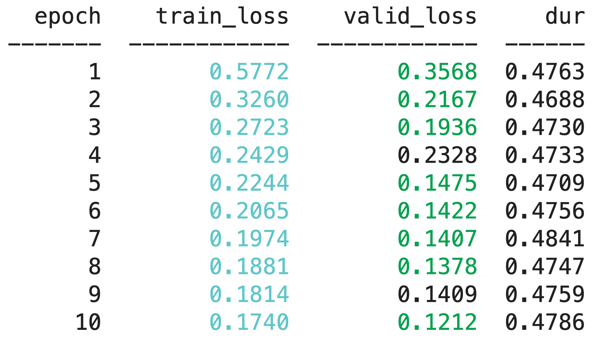

---

# MNIST - Continue Training

```python
net.set_params(max_epochs=5)
_ = net.partial_fit(X_train, y_train)
```


---

# MNIST - History

[.code-highlight: all]
[.code-highlight: 1-2]
[.code-highlight: 4-5]
[.code-highlight: 7-9]

```python
len(net.history)
# 15

net.history[-1, 'valid_loss']
# 0.10163110941932314

net.history[-2:, 'train_loss']
# [0.13314295971961249,
#  0.1330454680351984]
```

---

# MNIST - Accuracy Score

[.code-highlight: all]
[.code-highlight: 1-4]
[.code-highlight: 6-7]
[.code-highlight: 9-10]

```python
y_pred = net.predict(X_test)
print(y_pred[0, :])
# [ -3.7149053   -3.4425774    4.2277       6.454636   -11.068788
#   2.8243313   -4.5492096   -2.9567776   11.11874     -0.02089611]

def accuracy_argmax(y_true, y_pred):
    return np.mean(y_true == np.argmax(y_pred, -1))

print('test accuracy:', accuracy_argmax(y_test, y_pred))
# test accuracy: 0.9634857142857143
```

---

# MNIST - EpochScoring

[.code-highlight: all]
[.code-highlight: 1-2]
[.code-highlight: 4-9]
[.code-highlight: 11-12]

```python
from sklearn.metrics import make_scorer
accuracy_argmax_scorer = make_scorer(accuracy_argmax)

from skorch.callbacks import EpochScoring

epoch_acc = EpochScoring(
    accuracy_argmax_scorer,
    name='valid_acc',
    lower_is_better=False)

net = NeuralNet(...,
    callbacks=[epoch_acc])
```

---

# MNIST - Fitting With EpochScoring

```python
_ = net.fit(X, y)
```


---

# MNIST - Scikit-Learn Integration

[.code-highlight: all]
[.code-highlight: 1-6]
[.code-highlight: 8-10]

```python
from sklearn.pipeline import Pipeline
from sklearn.preprocessing import MinMaxScaler

pipe = Pipeline([
    ("min_max", MinMaxScaler()),
    ("net", net)])

_ = pipe.fit(X_train, y_train)
```

---

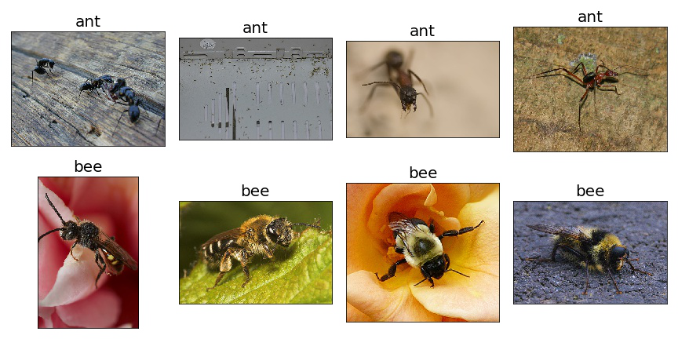

---


# Ants and Bees - ImageFolder Transformations

[.code-highlight: all]
[.code-highlight: 1-8]
[.code-highlight: 10-13]

```python
import torchvision.transforms as tfms

train_tfms = tfms.Compose([
    tfms.RandomResizedCrop(224),
    tfms.RandomHorizontalFlip(),
    tfms.ToTensor(),
    tfms.Normalize([0.485, 0.456, 0.406],
                   [0.229, 0.224, 0.225])])

train_ds = ImageFolder(
    "datasets/hymenoptera_data/train" , train_tfms)
valid_ds = ImageFolder(
    "datasets/hymenoptera_data/val" , val_tfms)
```

---

# Ants and Bees - ImageNet

- 1000 classes
- 1300 images for each class
- Mean of ImageNet: `[0.485, 0.456, 0.406]`
- Standard Deviation of ImageNet: `[0.229, 0.224, 0.225]`

---

# Ants and Bees - ResNet Model

[.text: text-scale(0.5)]


K. He, X. Zhang, S. Ren, and J. Sun. Deep residual learning for image recognition. In Proceedings of CVPR, pages 770–778, 2016. [arxiv.org/abs/1512.03385](https://arxiv.org/abs/1512.03385)

---

# Ants and Bees - ResNet Model Code

[.code-highlight: all]
[.code-highlight: 1,7-8]

```python
from torchvision.models import resnet18
import torch.nn as nn

class PretrainedModel(nn.Module):
    def __init__(self):
        super().__init__()
        self.model = resnet18(pretrained=True)
        self.model.fc = nn.Linear(512, 2)

    def forward(self, X):
        return self.model(X)
```

---

# Ants and Bees - Freezer


```python
from skorch.callbacks import Freezer

freezer = Freezer(
    lambda name: not name.startswith("model.fc"))
```

---

# Ants and Bees - Learning Rate Scheduler

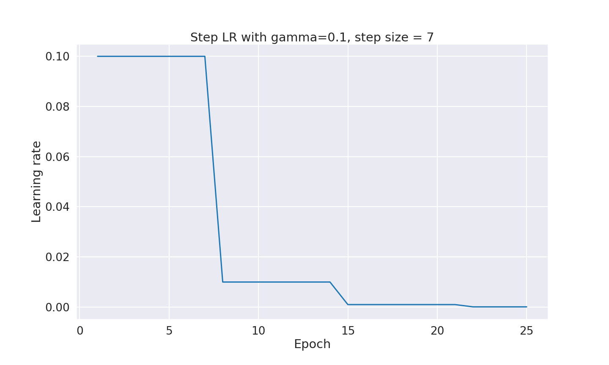

```python
from skorch.callbacks import (
    LRScheduler
)

lr_scheduler = LRScheduler(
    policy="StepLR",
    step_size=7,
    gamma=0.1)
```

---

# Ants and Bees - Checkpoints

[.code-highlight: all]

```python
from skorch.callbacks import Checkpoint

epoch_acc = EpochScoring(..., name='valid_acc',
    lower_is_better=False)

checkpoint = Checkpoint(
    dirname="exp_01_bee_vs_ant", monitor="valid_acc_best")
```

---

# Ants and Bees - Skorch NeuralNet

[.code-highlight: all]
[.code-highlight: 7-8]
[.code-highlight: 1,6]

```python
from skorch.helper import predefined_split

net = NeuralNet(
    PretrainedModel,
    lr=0.001, batch_size=4,
    train_split=predefined_split(val_ds),
    callbacks=[freezer, lr_scheduler,
        epoch_acc, checkpoint],
    ...
)
```

---

# Ants and Bees - Fitting

```python
_ = net.fit(train_ds)
```


---

# Ants and Bees - Checkpoint Files

```bash
exp_01_bee_vs_ant
├── history.json
├── optimizer.pt
└── params.pt
```

---

# Ants and Bees - Loading from Checkpoint

```python
# net.fit(...) was called
net.load_params(checkpoint=checkpoint)

val_output = net.predict(val_ds)
```

---

# Ants and Bees - Prediction

[.code-highlight: all]
[.code-highlight: 1-3]
[.code-highlight: 5-7]
[.code-highlight: 9-11]

```python
checkpoint = Checkpoint(...,
    dirname="exp_01_bee_vs_ant",
    monitor="valid_acc_best")

net = NeuralNet(PretrainedModel, ...)
net.initialize()
net.load_params(checkpoint=checkpoint)

val_pred = net.predict(val_ds)
```

---

# Ants and Bees - Prediction Numpy

[.code-highlight: all]
[.code-highlight: 1-2]
[.code-highlight: 4-6]
[.code-highlight: 8-10]

```python
print(X_numpy.shape)
# (1, 3, 224, 224)

X_pred = net.predict(X_numpy)
print(X_pred)
# [[ 0.4966519, -0.9894746]]

print(softmax(X_pred))
# [[0.8154962  0.18450384]]
```

---


---

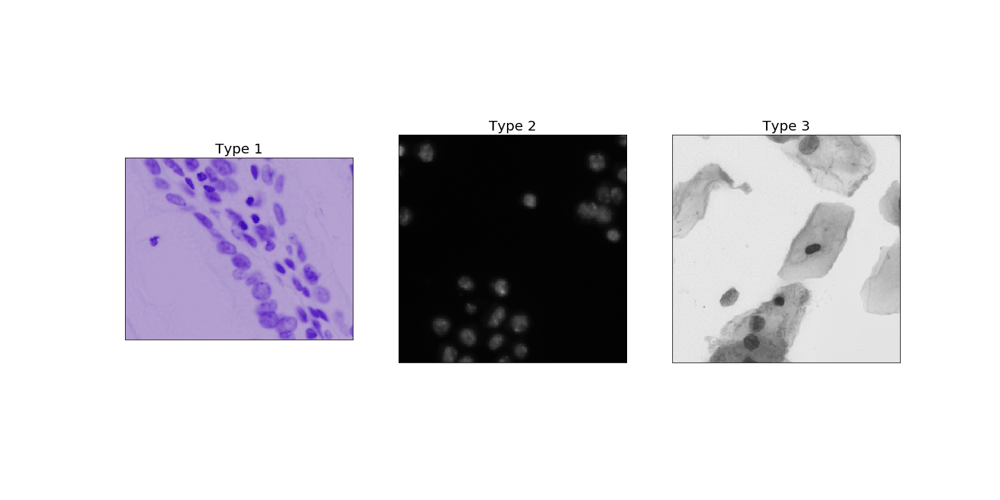
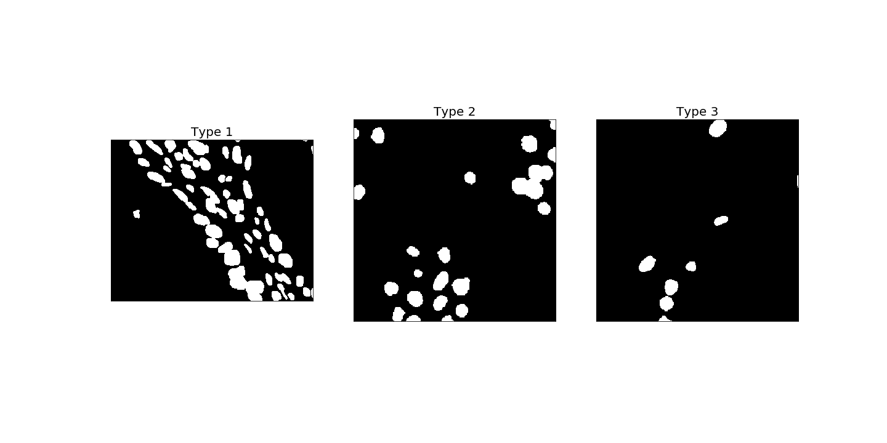

---

# Nuclei Image Segmentation - Dataset

```python
train_cell_ds = CellsDataset(...)
valid_cell_ds = CellsDataset(...)

print(train_cell_ds[0])
# (<PIL.Image.Image>
#  <PIL.PngImagePlugin.PngImageFile>)
```

---

[.text: text-scale(0.5)]

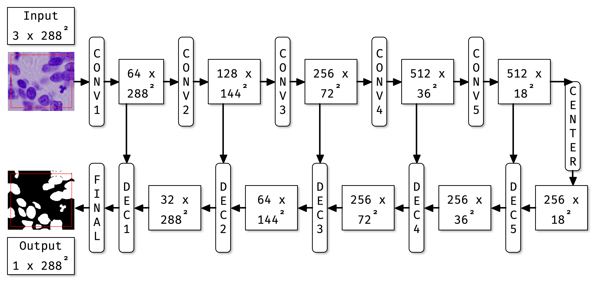

O. Ronneberger, P. Fischer, and T. Brox, “U-net: Convolutional networks for biomedical image segmentation,” in MICCAI, pp. 234–241, Springer, 2015. [arxiv.org/abs/1505.04597](https://arxiv.org/abs/1505.04597)

---

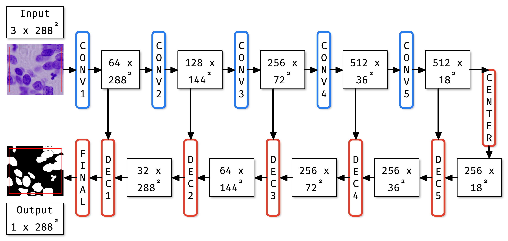

```python
from skorch.callbacks import Freezer
freezer = Freezer('conv*')
```

---


### Nuclei Image Segmentation - PatchedDataset 1


---

### Nuclei Image Segmentation - PatchedDataset 2

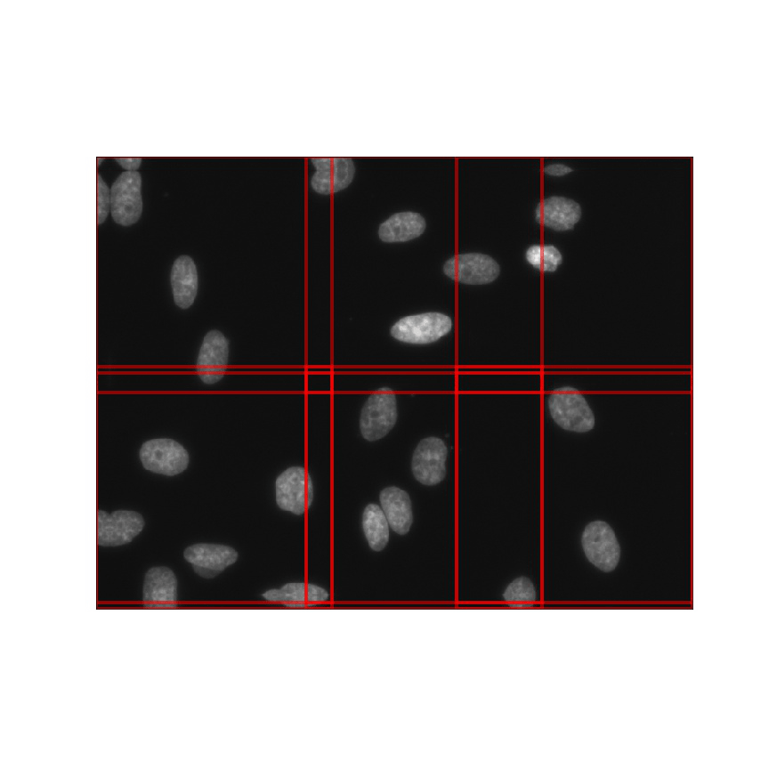

---

# Nuclei Image Segmentation - PatchedDataset Code

```python
train_ds = PatchedDataset(
    train_cell_ds, patch_size=(256, 256),
    padding=16, random_flips=True)

val_ds = PatchedDataset(
    valid_cell_ds, patch_size=(256, 256),
    padding=16, random_flips=False)
```

---

# Nuclei Image Segmentation - IOU

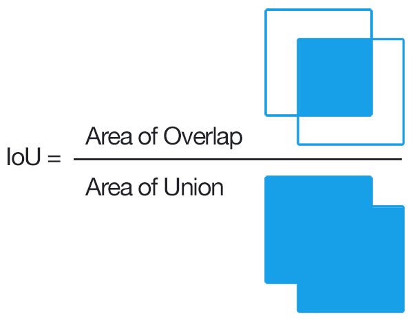

---

# Nuclei Image Segmentation - IOU Metric

[.code-highlight: all]
[.code-highlight: 1-4]
[.code-highlight: 6-7]
[.code-highlight: 6-11]

```python
def approximate_iou_metric(
        true_masks, predicted_logit_masks, padding=16):
    ... # returns metric
iou_scoring = make_scorer(approximate_iou_metric)

iou_scoring = EpochScoring(
    iou_scoring, name='valid_iou', lower_is_better=False)

best_cp = Checkpoint(
    dirname="kaggle_seg_exp01", monitor="valid_iou_best")
```

---

# Nuclei Image Segmentation - Custom Loss

[.code-highlight: all]
[.code-highlight: 1-4,9-10]
[.code-highlight: 8]

```python
class BCEWithLogitsLossPadding(nn.Module):
    def __init__(self, padding):
        super().__init__()
        self.padding = padding
    ...

net = NeuralNet(
    UNet,
    criterion=BCEWithLogitsLossPadding,
    criterion__padding=16,
    ...
)
```

---

# Nuclei Image Segmentation - Cyclic LR Scheduler

```python
cyclicLR = LRScheduler(
    policy="CyclicLR",
    base_lr=0.002,
    max_lr=0.2,
    step_size_up=550,
    step_size_down=550)
```


---

# Nuclei Image Segmentation - NeuralNet

[.code-highlight: all]
[.code-highlight: 5-8]

```python
net = NeuralNet(
    UNet,
    criterion=BCEWithLogitsLossPadding,
    criterion__padding=16,
    batch_size=32,
    max_epochs=20,
    train_split=predefined_split(val_ds),
    callbacks=[freezer, cyclicLR, iou_scoring, best_cp],
    ...
)
```

---

# Nuclei Image Segmentation - NeuralNet DataLoader

[.text: text-scale(0.8)]

PyTorch's `DataLoader(pin_memory=False, num_workers=0, ...)`

[.code-highlight: all]
[.code-highlight: 2-4]
[.code-highlight: 5-7]
[.code-highlight: 9]

```python
net = NeuralNet(...,
    iterator_train__shuffle=True,
    iterator_train__num_workers=4,
    iterator_train__pin_memory=True,
    iterator_valid__shuffle=False,
    iterator_valid__num_workers=4,
    iterator_valid__pin_memory=True)

_ = net.fit(train_ds)
```

---

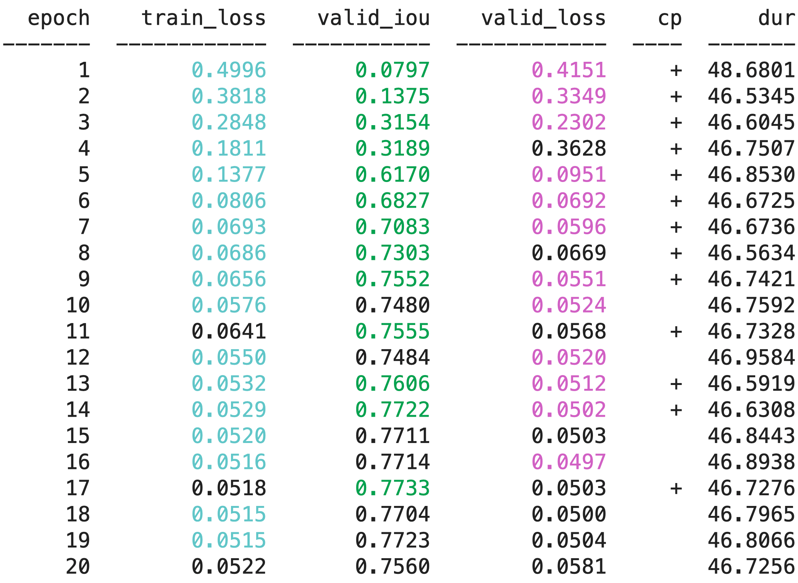

---

# Nuclei Image Segmentation - Predict on Validation

[.code-highlight: all]
[.code-highlight: 1]
[.code-highlight: 3-5]
[.code-highlight: 7-9]

```python
net.load_params(checkpoint=best_cp)

val_masks = net.predict(val_ds)
print(val_masks.shape)
# (468, 1, 288, 288)

val_prob_masks = sigmod(val_masks.squeeze(1))
print(val_prob_masks.shape)
# (468, 288, 288)
```

---

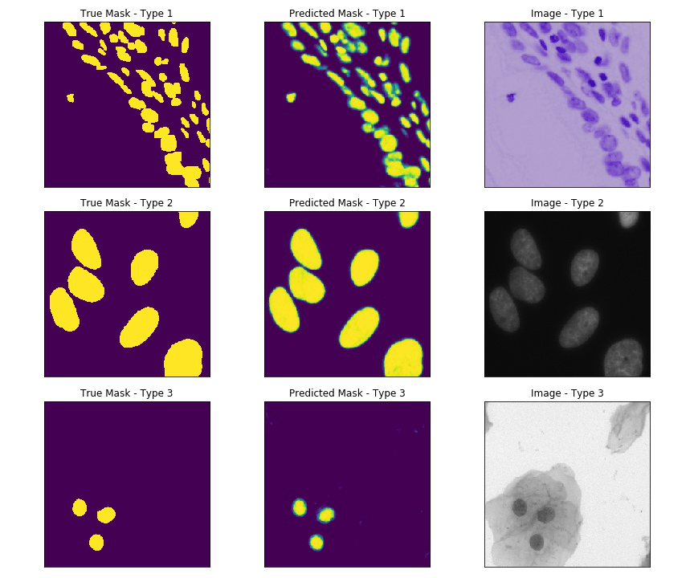

---

# Skorch - Closing 1

1. Scikit-Learn compatible neural network library that wraps PyTorch.
  - `net.fit(X, y)`
  - `net.partial_fit(X, y)`
  - `net.predict(X)`
  - `net.set_params(...)`
2. Abstracts away the training loop.

---

# Skorch - Closing 2

3. Reduces the amount of boilerplate code with callbacks.
  - `EpochScoring`
  - `Freezer`
  - `Checkpoint`
  - `LRScheduler`
  - [skorch.readthedocs.io/en/stable/user/callbacks.html](https://skorch.readthedocs.io/en/latest/user/callbacks.html)

---

# Skorch - Whats next


- [github.com/thomasjpfan/skorch\_talk](https://github.com/thomasjpfan/skorch_talk)
- [github.com/skorch-dev/skorch](https://github.com/skorch-dev/skorch)
- [skorch.readthedocs.io](https://skorch.readthedocs.io/)
- Thomas J Fan - @thomasjpfan

---


# Appendix Nuclei Image Segmentation - Cyclic LR Scheduler

- Number of training samples: `len(train_ds) = 1756`
- `max_epochs = 20`
- `batch_size = 32`
- Training iterations per epoch: `ceil(1756/32) = 55`
- Total number of iterations: `55*20 = 1100`


---

# Appendix Ants and Bees - Saving and Loading

[.code-highlight: all]
[.code-highlight: 5]
[.code-highlight: 1-2,7-9]
[.code-highlight: 11-14]

```python
from skorch.callbacks import TrainEndCheckpoint
from skorch.callbacks import LoadInitState

def run(max_epochs):
    best_cp = Checkpoint(dirname="exp_02", ...)

    train_end_cp = TrainEndCheckpoint(
        dirname="exp_02", fn_prefix="train_end_")
    load_state = LoadInitState(train_end_cp)

    net = NeuralNet(...,
        max_epochs=max_epochs,
        callbacks=[..., best_cp, train_end_cp, load_state]
    ).fit(train_ds)
```

---

# Appendix Ants and Bees - Saving and Loading Checkpoints

```bash
exp_02
├── history.json
├── optimizer.pt
├── params.pt
├── train_end_history.json
├── train_end_optimizer.pt
└── train_end_params.pt
```

---

# Appendix Ants and Bees - Saving and Loading First Run

```python
run(max_epochs=10)
```


---

# Appendix Ants and Bees - Saving and Loading Second Run

```python
run(max_epochs=5)
```


---

# Ants and Bees - Folder Structure

```bash
datasets/hymenoptera_data/
├── train
│   ├── ants
│   └── bees
└── val
    ├── ants
    └── bees
```

---

# Ants and Bees - ImageFolder Init

```python
from torchvision.datasets import ImageFolder

train_tfms = ...
val_tfms = ...

train_ds = ImageFolder(
    "datasets/hymenoptera_data/train" , train_tfms)
val_ds = ImageFolder(
    "datasets/hymenoptera_data/val", val_tfms)
```

---

# Ants and Bees - ImageFolder Class

Subclass of `torch.utils.data.Dataset`

[.code-highlight: all]
[.code-highlight: 1-2]
[.code-highlight: 4-6]
[.code-highlight: 8-10]

```python
print(len(train_ds), len(val_ds))
# (244, 153)

img, target = train_ds[0]
print(img.shape, target)
# (torch.Size([3, 224, 224]), 0)

# For ImageFolder only:
print(train_ds.class_to_idx)
# {'ants': 0, 'bees': 1}
```

---

# MNIST - Grid Search

[.code-highlight: all]
[.code-highlight: 1-7]
[.code-highlight: 8-12]

```python
from sklearn.model_selection import GridSearchCV

param_grid = {"net__module__dropout": [0.2, 0.5, 0.8]}

gs = GridSearchCV(pipe, param_grid, cv=3,
                  scoring=accuracy_argmax_scorer)
_ = gs.fit(X, y)
print("best score:", gs.best_score_)
# best score: 0.9651

print("best_params", gs.best_params_)
# best_params {'net__module__dropout': 0.2}
```

---

# MNIST - More sckit-learn like - 1

```python
from sklearn.base import ClassifierMixin
from sklearn.utils.extmath import softmax
from skorch import NeuralNet

class MyNNClassifer(ClassifierMixin, NeuralNet):
    def predict_proba(self, X):
        y_pred = super().predict_proba(X)
        return softmax(y_pred)

    def predict(self, X):
        y_pred = super().predict(X)
        return np.argmax(y_pred, axis=1)
```

---

# MNIST - More sckit-learn like - 2

```python
epoch_acc = EpochScoring(
    'accuracy',
    name='valid_acc',
    lower_is_better=False)

net = MyNNClassifer(
    SimpleFeedforward,
    ...,
    callbacks=[epoch_acc])
```
